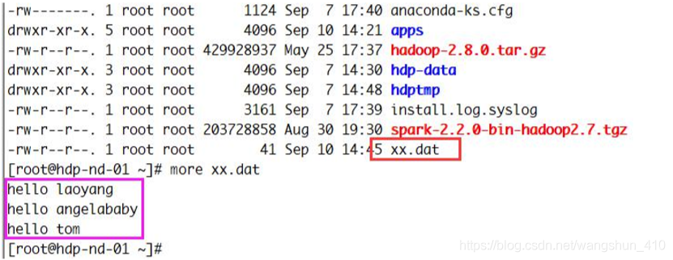
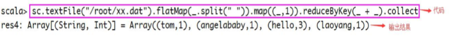
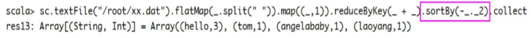

# 1 基本语法
## 1.1 函数式编程体验 Spark-Shell 之 WordCount
- 数据准备

- wordCount

- 排序

## 1.2 Scala 交互模式(cmd 窗口介绍)
## 1.3 数据类型
- Scala 和 Java 一样，有 7 种数值类型 Byte、Char、Short、Int、Long、Float 和 Double（无包 装类型）和 Boolean、Unit 类型.
- 注意: Unit表示无值，和其他语言中void 等同。用作不返回任何结果的方法的结果类型。Unit 只有一个实例值，写成()。
## 1.4 变量的定义
```scala
object 变量定义 extends App { 
    /** 
      * 定义变量使用var或者val关键字 
      *
      * 语法: 
      *  var | val 变量名称(: 数据类型) = 变量值
      */
    // 使用val修饰的变量, 值不能为修改,相当于java中final修饰的变量 
    val name = "tom"
 
    // 使用var修饰的变量,值可以修改 
    var age = 18
 
    // 定义变量时,可以指定数据类型,也可以不指定,不指定时编译器会自动推测变量的数据类型 
    val name2 : String = "jack"
}
```
## 1.5 字符串的格式化输出
```scala
/*
 * Scala 中的格式化输出
 */
 
object ScalaPrint extends App {
 
  val name = "JackMa"
  val price = 998.88d
  val url = "www.baidu.com"
  // 普通输出,注意这里是可以使用逗号分隔的，但是在java中，我们是需要用“+”号拼接
  println("name=" + name,"price="+price,"url="+url)
 
  // 'f'插值器允许创建一个格式化的字符串，类似于C语言中的printf。
  // 在使用'f'插值器时，所有变量引用都应该是printf样式格式说明符，如％d ,％i ,％f等 。
  // 这里$name％s打印String变量name,
  println(f"姓名：$name%s,价格：$price%1.2f,网址：$url%s")
  println(f"姓名：%%s,价格：%%1.1f,网址：%%s",name,price,url)
 
  // 's'插值器允许在字符串中直接使用变量
  // 下列语句中将String型变量（$name）插入到普通字符串中
  println(s"name=$name,price=$price,url=$url")
 
  //'s'插值器还可以处理任意形式的表达式
  println(s"1+1=${1+1}") //output "1+1=2"
}
```
## 1.6 条件表达式
```scala
/*
 * Scala if条件表达式
 */
object ScalaIf extends App {
   //if语句的使用
    var faceValue=98
    var res1=if (faceValue>90) "帅" else "有点恼火"
    print(res1)
 
    //3>5 不成立，且代码没有else分支，那么res2应该输出什么呢？
    var i=3
    var res2=if (i>5) i
    print(res2)// output  ()代表空
 
    // 支持嵌套，if...else if ...else代码过多时可以使用{}
    val score=85
    if(score<60)"不及格"
    else if(score>=60&&score<70)"及格"
    else if (score>=80&&score<90)"优秀"
    else "优秀"
}
```
## 1.7 循环语句和yeild关键字
```scala

/*
 * Scala for循环
 */
object ScalaFor extends App {
    //  定一个数组
    var arr=Array(1,2,3,4,5,6)
 
    //遍历数组中么个元素
    for(ele <- arr){
      print(ele)
    } /*output:1 2 3 4 5 6*/
 
    // 0 to 5 =>会生成一个范围集合Range（0,1,2,3,4,5),左闭右闭
    for(i <- 0 to 5){
      print(i) /*output:0,1,2,3,4,5*/
    }
 
    // 0 until 5 =>会生成一个范围集合Range（0,1,2,3,4)，左闭右开
    for(i <- 0 until 5){
      print(i) /*output:0,1,2,3,4*/
    }
 
    // for循环中可以增加守卫，下面这段语句是打印arr数组中的偶数
    for(i <- arr if i%2==0){
      print(i)
    }/*input:2,4,6*/
 
    //双层for循环
    for (i <- 1 to 3;j <- 1 to 3 if i!=i){
      print(i*10+j+"")
    }/*output:12,13,21,23,31,32*/
 
    //  yield 关键字将满足条件的e的值又组合成一个数组
    var arr2=for(e <- arr if e%2==0)
       yield e
    for (i <- arr2){
      print(i)/*output:2,4,6*/
    }
}
```
## 1.8 运算符与运算符重载
Scala 中的+-*/%等操作符的作用与 Java 一样，位操作符 &|^>><<也一样。
只是有 一点特别的：这些操作符实际上是方法。
例如：
a+b
是如下方法调用的简写：
a.+(b)
a 方法 b 可以写成 a.方法(b)
## 1.9 方法的定义与调用
```scala
/*
 * 方法的定义及调用
 * 定义方法的格式为 :
 * def methodName ([listofparameters]) : [ returntype ] = { }
 * 如果不使用等号和方法体，则隐式声明抽象(abstract)方法 。
 */
object ScalaMethod extends App{
  // 定义一个sum方法，该方法有两个参数，返回值为int类型
  def sum(a:Int, b: Int): Int = { a + b }
  // 调用
  val result=sum(1,5)
  print(result)
  // 该方法没有任何参数 , 也没有返回值
  def sayHello1 = print("Say BB1")
  def sayHello2() = print("Say BB2")
  sayHello1 // 如果方法没有()调用时不能加()
  sayHello2() // 可以省略( ) ,也可以不省略
}
```
## 1.10 函数的定义与调用
方法一：
```scala
val f1 = (x: Int) => x*10
```
方法二
```scala
val f2:(Int, Int) => (x, y) => x*y
```
## 1.11 传值调用与传名调用
```scala
/*
 *scala的
 *      传名调用( call-by-name)
 *      传值调用( call-by-value)
 */
object ScalaCallName  extends App{
 
    def currentTime():Long={
      System.nanoTime();
    }
    // 该方法的参数为一个无参的函数,并且函数的返回值为Long
    def delayed(f: => Long): Unit ={
        print(s"time=${f}")
    }
    
    def delayed2(time: Long): Unit ={
      print(s"time=${time}")
    }
 
    //调用方式一
    delayed(currentTime())
 
    // 调用方式二
    // 等价于调用方式一，本质是先计算出参数的值，在带入方法
    var time=currentTime()
    delayed2(time)
 
}
```
## 1.12 可变参数函数
```scala
/*
 *scala的可变参数 
 */
object ScalaVarParams extends App{
    //定义一个可变参数方法
    def methodManyParams(params:Int*): Unit ={
      for (i <- params){
        print(i)
      }
    }
   // 调用
    methodManyParams(1,2,3,5)
}
```
## 1.13 默认参数值函数
```scala

/*
 *scala的默认参数
 */
object ScalaDefaultParams extends App{
    //定义一个默认参数方法
    def add(a:Int=1,b:Int=2): Int ={
       a+b
    }
    // 等价于add(a=3,b=2)
    add(3)
    // 等价于add(a=4,b=5)
    add(4,5)
    // 等价于add(a=1,b=5)
    add(b=5)
}
```
## 1.14 高阶函数
```scala
/*
 *scala的高阶函数
 */
object ScalaHM extends App{
    //  高阶函数将其他函数作为参数
    def apply(f:Int => Int,p:Int): Unit ={
      print(f(p))
    }
 
    def fn1(a:Int): Int ={
        a*a
    }
    apply(fn1,10)/*output：100*/
}
```
## 1.15 部分参数应用函数
```scala
/*
 *scala的部分参数
 */
object ScalaPartParams extends App{
    //定义了一个求和函数
    def sum(a:Int,b:Int): Int ={
         a+b
    }
    // 调用sum函数的时候，传入了一个参数a=10，但是b为待定参数。
    // sumWithTen形成了一个新的函数，参数个数为一个，类型为int型，
    def sumWithTen:Int => Int=sum(10,_: Int)
 
    //sumWithTen(1),本质是sum(10,1)
    print(sumWithTen(1))
}
```
